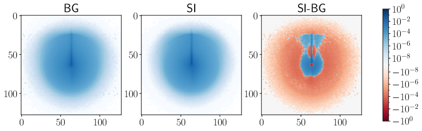
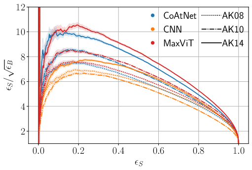

# stop_pair_vision_transformers
A new proof of concept, that shows that recent innovations in vision transformers can immediately result in improved classification performance in physics scenarios. Here you can find the code for the publication [Learning to see R-parity violating scalar top decays](https://arxiv.org/abs/2406.03096) for demonstration purposes. For more details we recommend the publication.

Jets of particles are registered in detectors of high energy colliders. These detectors are similar to ordinary cameras and resolve what happens inside the experiment in two spatial (angular) dimensions. The deposited energy of each particle in the detector can be seen as the pixel brightness. The channel (i.e., RGB color in normal images) represents the specific detector layer.

<figure>
    
    <figcaption>The average of all signal and background images.</figcaption>
</figure>

Combining three detector layers, we can use [CoAtNet](https://arxiv.org/abs/2106.04803) and [MaxViT](https://arxiv.org/abs/2204.01697) to predict whether a given jet is likely to originate from the signal process or the background. We can show that this improves the classification performance with respect to more classical convolutional neural networks. To achieve this performance boost, one simply needs to change the model, keeping the dataset constant. 

<figure>
    
    <figcaption>Classification performancen (larger=better) of all three models on all three jetsizes (AK08, AK10, AK14), as a function of the true positive rate.</figcaption>
</figure>

The number of samples has been lowered compared to the publication to allow quicker training with minimal performance loss. 

## Usage:
1. Get in touch and download [signal](https://zenodo.org/records/13236906) and [background](https://zenodo.org/uploads/13269304) datasets into the directory train_data
2. Run `python setup.py` to set up the directories and data files containing information for training
3. Run the `./train_all.sh` script. This trains all models for all jet types for 5 epochs (compared to 15 in the publication). It takes about a week on a NVIDIA GeForce RTX 3060 Ti
4. Run `python predict_base_model_mass.py` to use all 9 base models to infer labels on the test data for each neutralino and stop mass separately
5. Run `python fit_xgb.py` to train and evaluate the gradient boosted decision trees
6. Run `python plots.py` to generate all plots of the publication
